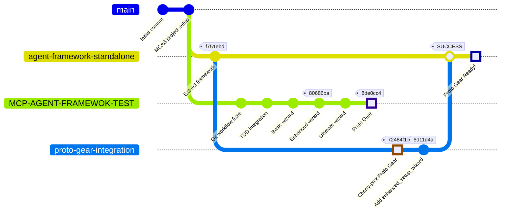

# 🍒 Proto Gear Cherry-Pick Integration Diagram

## Visual Git Flow



## 📊 Detailed Process Flow

### Step 1: Initial State
```
MCP-AGENT-FRAMEWOK-TEST (source branch)
    │
    ├── 8de0cc4: "add agent-framework setup wizard" ← Proto Gear commit
    ├── 80686ba: "feat: Implement enhanced setup wizard"
    └── ... (earlier commits)

agent-framework-standalone (target branch)
    │
    └── f751ebd: "feat: Extract agent-framework as standalone package"
```

### Step 2: Create Integration Branch
```bash
git checkout agent-framework-standalone
git checkout -b proto-gear-integration
```

```
agent-framework-standalone
    │
    └──→ proto-gear-integration (new branch)
```

### Step 3: Cherry-Pick Operation
```bash
git cherry-pick 8de0cc4
```

```
proto-gear-integration
    │
    ├── 72484f1: Cherry-picked "add agent-framework setup wizard"
    │   └── Conflict in setup_wizard.py (resolved)
    └── f751ebd: (inherited from parent)
```

### Step 4: Add Missing File
```bash
git checkout MCP-AGENT-FRAMEWOK-TEST -- agent-framework/core/enhanced_setup_wizard.py
git commit -m "fix: Add missing enhanced_setup_wizard.py"
```

```
proto-gear-integration
    │
    ├── 6d11d4a: "fix: Add missing enhanced_setup_wizard.py"
    ├── 72484f1: Cherry-picked Proto Gear
    └── f751ebd: (inherited)
```

### Step 5: Merge to Standalone
```bash
git checkout agent-framework-standalone
git merge proto-gear-integration  # Fast-forward merge
```

```
agent-framework-standalone (final state)
    │
    ├── 6d11d4a: Enhanced wizard fix ← HEAD
    ├── 72484f1: Proto Gear features
    └── f751ebd: Original standalone
```

## 📈 Changes Summary

| Metric | Value |
|--------|-------|
| **Files Changed** | 12 |
| **Additions** | +5,525 lines |
| **Deletions** | -115 lines |
| **Conflicts Resolved** | 1 (setup_wizard.py) |
| **Missing Files Added** | 1 (enhanced_setup_wizard.py) |

## 🎯 Key Points

1. **Cherry-pick preserved commit history** - The Proto Gear commit message and authorship were maintained
2. **Clean integration** - Only one conflict, easily resolved
3. **Fast-forward merge** - No merge commit needed, linear history preserved
4. **Isolated changes** - Only agent-framework changes were brought over, no MCAS-specific files

## 📦 Files Integrated

```
✅ agent-framework/core/proto_gear.py (NEW)
✅ agent-framework/core/multiplatform_wizard.py (NEW)
✅ agent-framework/core/ultimate_setup_wizard.py (NEW)
✅ agent-framework/core/enhanced_setup_wizard.py (ADDED SEPARATELY)
✅ agent-framework/core/setup_wizard.py (UPDATED)
✅ agent-framework/setup.py (UPDATED)
✅ agent-framework/README.md (UPDATED)
✅ agent-framework/docs/*.md (5 NEW DOCS)
```

## 🚀 Result

The `agent-framework-standalone` branch now contains all Proto Gear enhancements while maintaining a clean, linear git history suitable for:
- Independent development
- PyPI package release
- Separate repository migration

---

*Integration completed successfully on Sunday, August 31, 2025*